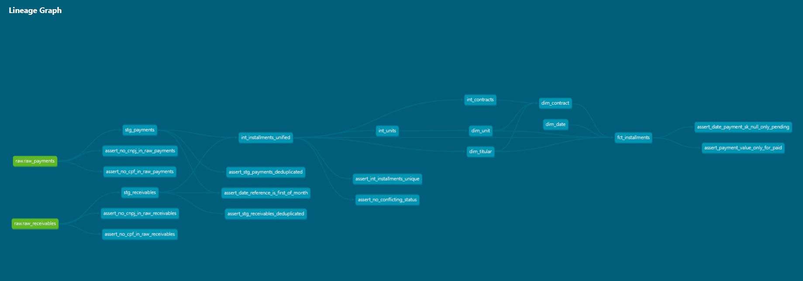
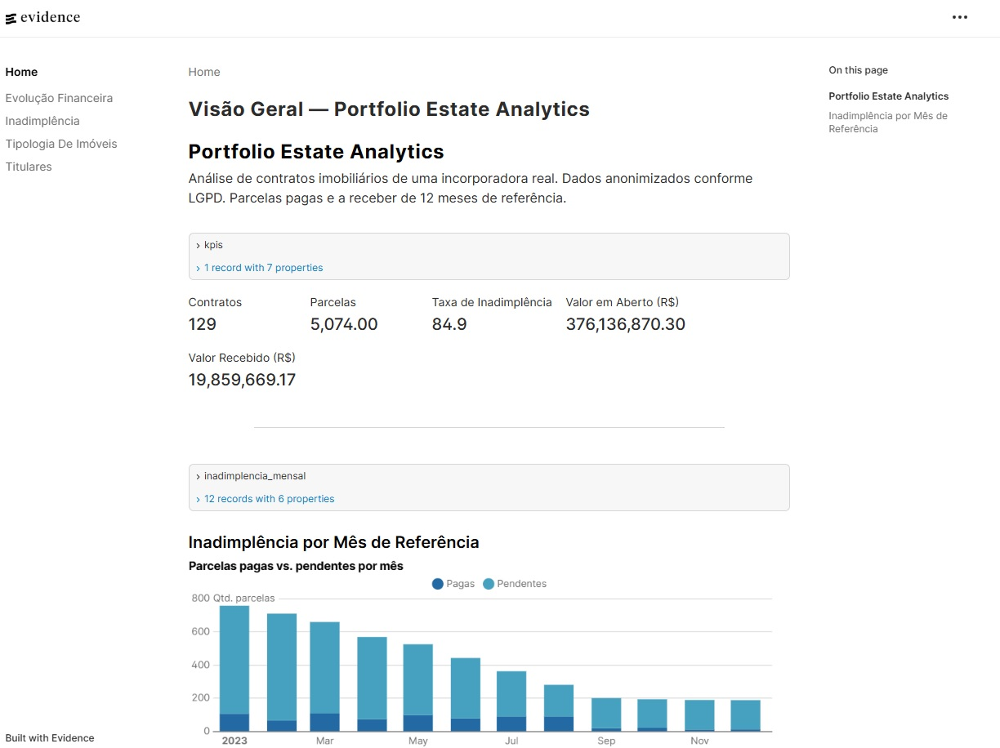

# portfolio_estate_analytics

An end-to-end Analytics Engineering portfolio project built by [Lucas de Araújo](https://github.com/lucasricardoaa).

Covers the full pipeline over real estate contract data:
LGPD-compliant anonymization → BigQuery ingestion → dbt transformation → Evidence.dev dashboards.

---

## Stack

| Layer | Technology |
|---|---|
| Anonymization & ingestion | Python (`pandas`, `openpyxl`, `Faker`, `google-cloud-bigquery`, `pyarrow`, `colorlog`) |
| Storage & processing | Google BigQuery |
| Transformation | dbt Core + dbt-bigquery + dbt_utils |
| Visualization | Evidence.dev |
| Version control | Git + GitHub |

---

## Data Architecture

```
[Local — never versioned]
/data/original/*.xlsx  (12 months of real estate contracts)
        ↓
scripts/anonymize_and_load.py
  · Anonymizes CPF/CNPJ and names in memory (Faker + hash + salt)
  · Loads into BigQuery (raw.raw_payments, raw.raw_receivables)
  · Logs each run in raw.pipeline_runs
        ↓
[BigQuery]
raw          → raw_payments, raw_receivables, pipeline_runs
        ↓  dbt build
staging      → stg_payments, stg_receivables
        ↓
intermediate → int_installments_unified, int_contracts, int_units
        ↓
marts        → fct_installments, dim_titular, dim_contract, dim_unit, dim_date
        ↓
Evidence.dev  (code-based dashboards)
```

### Dimensional Model

Star schema with `fct_installments` as the fact table (granularity: installment × month).
Four dimensions: `dim_titular`, `dim_contract`, `dim_unit`, `dim_date`.
Three foreign keys to `dim_date` covering reference month, maturity date, and payment date.
All dimensions follow SCD Type 1.

.png)

### dbt DAG



### dbt Docs



---

## Dashboards (Evidence.dev)

[Evidence.dev](https://evidence.dev) renders dashboards from SQL + Markdown files — the same way
engineers build applications. Queries and pages are version-controlled alongside the dbt models,
making the visualization layer a first-class citizen of the data pipeline.

Five pages covering:
- **Overview** — KPIs: contracts, installments, default rate, open and received amounts
- **Default** — monthly breakdown by reference month, holder type, and estate
- **Holders** — PF vs. PJ distribution, contracts, portfolio value, default rate
- **Financial Evolution** — monthly receivables vs. open amounts, by installment type
- **Typology** — contracts and default rate by property typology and type

---

## Repository Structure

```
portfolio_estate_analytics/
├── docs/
│   └── adr/               ← ADRs 000–009 (architectural source of truth)
├── models/
│   ├── staging/           ← stg_payments, stg_receivables
│   ├── intermediate/      ← int_installments_unified, int_contracts, int_units
│   └── marts/             ← fct_installments, dim_*, dim_date
├── reports/               ← Evidence.dev project (pages + BigQuery queries)
├── scripts/
│   ├── anonymize_and_load_template.py   ← template without credentials
│   └── verify_anonymization.py          ← validates absence of PII
├── tests/
│   ├── raw/               ← 4 PII residual tests (CPF/CNPJ)
│   ├── staging/           ← 3 tests (deduplication, date_reference)
│   ├── intermediate/      ← 2 tests (post-UNION uniqueness, status)
│   └── marts/             ← 2 financial consistency tests
├── dbt_project.yml
├── packages.yml
└── requirements.txt
```

---

## How to Reproduce

### Prerequisites

- Python 3.10+
- Google Cloud SDK (`gcloud`) authenticated
- GCP project with BigQuery enabled
- Node.js 18+ (for Evidence.dev)

### 1. Install Python dependencies

```bash
pip install -r requirements.txt
dbt deps
```

### 2. Set credentials

```bash
gcloud auth application-default login
export GCP_PROJECT_ID=your-gcp-project
```

Copy the ingestion template and fill in `HASH_SALT`, `FAKER_SEED`, and `ESTATE_MAPPING`:

```bash
cp scripts/anonymize_and_load_template.py scripts/anonymize_and_load.py
```

### 3. Ingest data

```bash
# Anonymize XLSX files and load into BigQuery
python scripts/anonymize_and_load.py

# Validate absence of PII before any commit
python scripts/verify_anonymization.py
```

### 4. Run dbt

```bash
dbt build
```

### 5. dbt docs

```bash
dbt docs generate
dbt docs serve
# → http://localhost:8080
```

### 6. Evidence.dev dashboards

```bash
cd reports
npm install --legacy-peer-deps
npm run sources   # runs queries against BigQuery
npm run dev       # → http://localhost:3000
```

---

## Data Quality Tests

| Layer | Tests |
|---|---|
| `raw` | No CPF or CNPJ in `raw_payments` or `raw_receivables` |
| `staging` | Deduplication via `MAX(date_upload)`, `date_reference` = first day of month |
| `intermediate` | Uniqueness after UNION, no conflicting payment status |
| `marts` | `date_payment_sk` null only for `pending`, `value_payment` null only for `pending` |

---

## Privacy & LGPD Compliance

No original data is versioned or publicly exposed.
Anonymization happens **in memory**, before any write to disk or BigQuery:
CPF and CNPJ are replaced with salted hashes; names with Faker-generated pseudonyms.
`verify_anonymization.py` validates the absence of PII residue in the raw tables.
Details in [ADR-003](docs/adr/0003-anonimizacao-e-privacidade.md).

---

## Architectural Decisions

All technical decisions are documented as ADRs in `docs/adr/`.
Start with [ADR-000](docs/adr/0000-visao-geral-e-roadmap.md) for a full project overview.

---

## AI-Assisted Development

This project uses Claude CLI as a development tool — SQL generation, ADR structuring,
and pipeline development. This choice is intentional and transparent: using AI as an
engineering tool is a professional skill, not a substitute for the author's technical judgment.
All architectural decisions were made and validated by Lucas — the AI executed, not decided.
